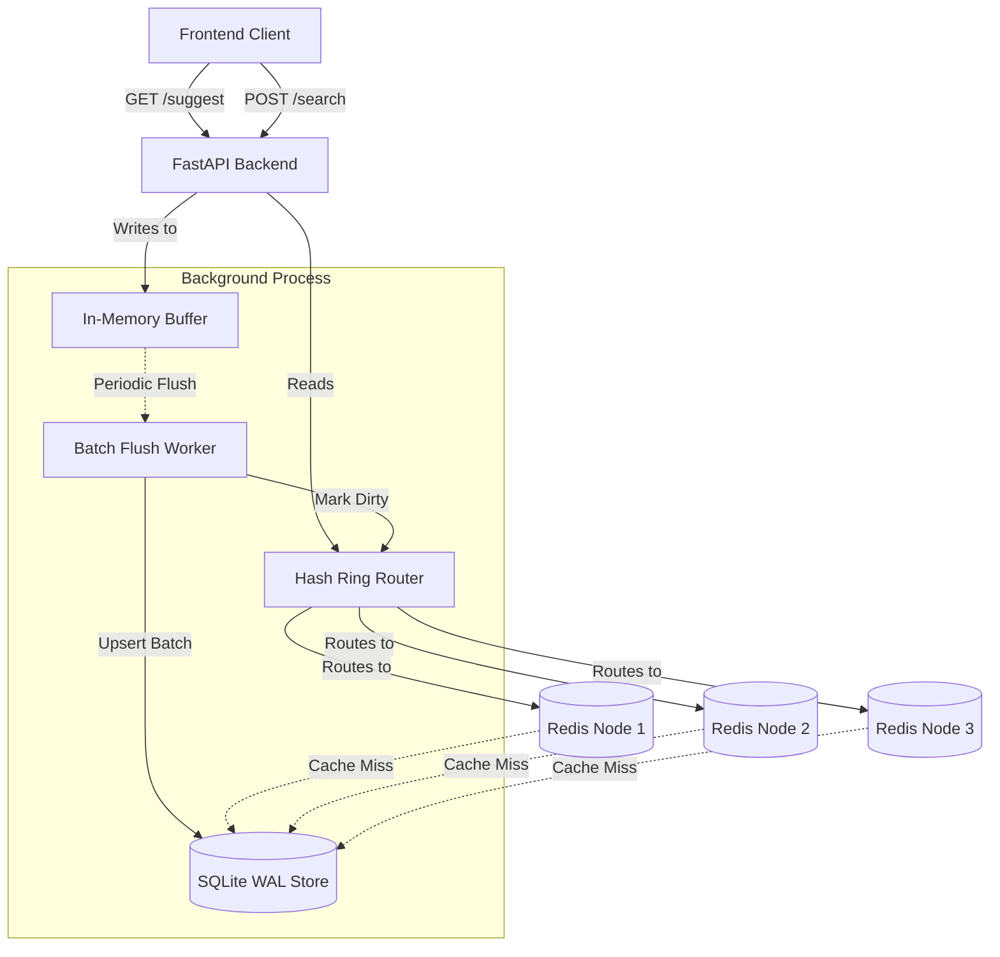

# Typeahead Search System

A high-performance, low-latency search typeahead system designed to serve suggestions dynamically as users type, handle large datasets, compute trending queries, and manage write-heavy workloads using background batching.

---

## 🏗 Architecture Overview

The system is designed with a multi-layered architecture focused on decoupling the read-heavy suggestion requests from the write-heavy search ingestions.



### Components:
1. **Primary Data Store (SQLite in WAL mode)**: Stores search queries, total counts, recency scores, and last updated timestamps.
2. **Distributed Cache (Redis)**: 3 separate Redis containers act as the caching layer to serve suggestions in <25ms.
3. **Consistent Hashing**: A Hash Ring with 100 virtual nodes distributes prefix keys evenly across the Redis nodes.
4. **Buffer & Batch Worker**: Search queries are aggregated in-memory and flushed periodically to SQLite to drastically reduce write IOPS.
5. **Time-Decay Ranking**: Blends all-time popularity with recent activity to determine trending searches.

---

## 🛠 Setup Instructions

### Prerequisites
* Python 3.10+
* Docker & Docker Compose

### 1. Start the Distributed Cache
Bring up the 3 Redis nodes:
```bash
docker compose up -d
```
*(This starts Redis instances on ports 6379, 6380, and 6381).*

### 2. Install Dependencies
```bash
python -m venv .venv
source .venv/bin/activate
pip install fastapi uvicorn redis
```

### 3. Start the Server
```bash
PYTHONPATH=. uvicorn backend.app:app --host 0.0.0.0 --port 8000 --reload
```

---

## 📊 Dataset Source and Loading

The system is tested using a **synthetically generated dataset** created by `generate_dataset.py`. This dataset mimics real-world search queries across many categories.
> **Source**: synthetically generated

### Ingestion
To populate the database with the synthetic data (e.g., 500,000 queries), run the included ingestion script:

```bash
PYTHONPATH=. python3 backend/load_testing/ingest_synthetic_data.py --rows 50000
```
*Note: The ingestion utilizes the batch-write pipeline automatically.*

---

## 🔌 API Documentation

### `GET /suggest?q=<prefix>`
Fetches the top 10 typeahead suggestions for a given prefix.
- **Returns**: Array of suggestions sorted by the unified ranking score (popularity + recency).
- **Latency**: Typically < 20ms (Cache hit < 5ms).

### `POST /search`
Submits a new search query.
- **Body**: `{ "query": "iphone charger" }`
- **Response**: `{ "status": "queued" }` *(Returns immediately while buffering in the background)*.

### `GET /trending?limit=<n>`
Fetches globally trending searches based on the time-decay algorithm.

### `GET /cache/debug?prefix=<prefix>`
**Debug Tool**: Identifies which Redis node a prefix is routed to and whether it results in a cache hit or miss.
- **Example Response**:
  ```json
  {
    "prefix": "iph",
    "node": "redis2",
    "cache_hit": true
  }
  ```

---

## 💡 Design Choices & Trade-offs

### 1. Write Batching vs. Immediate Consistency
* **Choice**: `POST /search` does not write directly to SQLite. It writes to an in-memory `BufferService`. A background `BatchFlushWorker` aggregates these counts and executes a single `executemany` SQL upsert every few seconds.
* **Trade-off**: We drastically reduce database write locks and IOPS. The trade-off is **eventual consistency** (a search won't appear in suggestions for a few seconds) and **durability risk** (if the server crashes before a flush, a few seconds of search counts are lost). For a typeahead system, losing a few statistical search counts is highly preferable over throttling the API.

### 2. Distributed Cache with Consistent Hashing
* **Choice**: Instead of a single massive cache, prefix keys are distributed across 3 Redis nodes using a custom `HashRing` (with virtual nodes to ensure balanced distribution).
* **Trade-off**: Adding/removing nodes only requires migrating `1/N` of the keys. However, it introduces slight computational overhead to hash the prefix on every request.

### 3. Cache Invalidation via "Dirty Prefixes"
* **Choice**: When a batch write occurs, instead of blindly deleting cache keys (which causes cache stampedes), we mark the specific prefixes as "dirty" in a Redis set.
* **Trade-off**: The next read request will notice the dirty flag, query the DB to get fresh data, update the cache, and remove the dirty flag. This is slightly slower on the very first read after an update, but guarantees we only recompute actively requested prefixes.

### 4. Trending Searches via Time-Decay
* **Choice**: Instead of just sorting by `total_count`, we maintain a `recent_score`. When a query is updated, its old `recent_score` decays exponentially based on `elapsed_hours` since the last update.
* **Trade-off**: Requires storing a `last_updated` timestamp and performing floating-point math during batch flushes, but results in a highly dynamic, "Reddit-style" trending feed where bursts of activity decay naturally over time without needing CRON jobs to clean up old data.

---

## Performance Evaluation

The system was benchmarked using a synthetic dataset containing **50,000 unique search queries**. The workload was ramped from **10 to 1,000 concurrent users**, with each user performing a mixture of search submissions and autocomplete requests. The architecture under test consisted of a FastAPI application layer, a distributed Redis cache using consistent hashing, SQLite as the source of truth, an in-memory write buffer, and a background batch-flush worker responsible for persisting updates and invalidating affected prefixes.

### Peak Load Results

| Metric | Value |
|----------|----------|
| Concurrent Users | 1,000 |
| Total Operations | 10,000 |
| Throughput | 486.8 ops/sec |
| Cache Hit Rate | 36.8% |
| Cache Hits | 2,602 |
| Database Reads | 4,468 |
| Average Latency | 415.8 ms |
| p50 Latency | 384.9 ms |
| p95 Latency | 680.4 ms |
| Buffer Flushes | 2 |

### Observations

- Successfully handled **1,000 concurrent users** without failures or throughput collapse.
- Redis served **2,602 requests directly from cache**, reducing pressure on the database layer.
- The write-buffer architecture significantly reduced database write frequency, requiring only **2 batch flushes** during the entire benchmark.
- Median autocomplete latency remained below **400 ms**, while **95% of requests completed within 680 ms**.
- The cache achieved a **36.8% hit rate** despite the workload consisting of **50,000 unique queries selected uniformly at random**, creating a low-locality access pattern that is challenging for caching systems.
- Dirty-prefix invalidation remained efficient, with only **420 dirty cache hits** recorded across the entire test run.
- Throughput remained stable as concurrency increased, peaking at approximately **487 operations per second**.

### Notes on Workload Characteristics

This benchmark intentionally uses a synthetic dataset with a very large number of unique queries and random query selection. As a result, cache locality is significantly lower than in real-world search systems, where traffic typically follows a Zipfian distribution and a small number of popular prefixes dominate requests.

Because of this, the measured cache hit rate should be considered a **stress-test result rather than a production expectation**. In a realistic deployment, higher cache hit rates and lower database read volumes would be expected due to repeated access to popular prefixes.

### Conclusion

The benchmark demonstrates that the system can sustain approximately **500 operations per second** while maintaining stable latency and effectively reducing database load through caching and batched writes. The results validate the overall architecture, including the distributed Redis cache, background flush worker, dirty-prefix invalidation strategy, and ranking pipeline. Despite operating under a deliberately challenging workload with low cache locality, the system remained stable and continued to derive measurable benefits from the caching layer.
