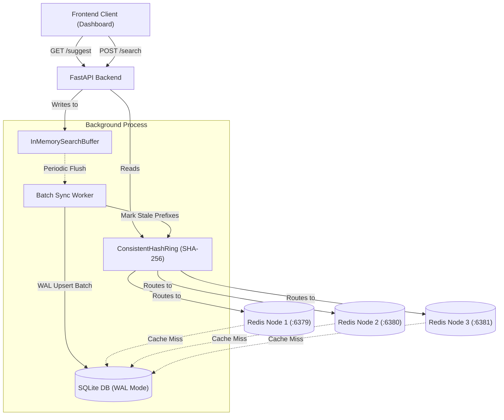

# 🚀 CoreTypeahead // Distributed Auto-Complete Engine

A high-performance, low-latency search typeahead system designed to serve suggestions dynamically, handle large datasets, calculate trending queries using time-decay algorithms, and manage write-heavy ingestions via background batch synchronization.

---

## 🏗️ Architecture Overview

The system utilizes a decoupled, multi-layered architecture designed to separate read-heavy suggestion lookup queries from write-heavy search ingestions.



### Key Components

1. **Primary Database Storage (SQLite in WAL Mode)**: Manages search phrases, aggregate hit counts, decay-adjusted activity scores, and update epochs. Optimized with write-ahead logging (WAL) to minimize locking.
2. **Distributed Cache Shards (Redis cluster)**: Three separate Redis instances cache query prefix matches to serve autocompletes under `<15ms`.
3. **Consistent Hashing Router (`ConsistentHashRing`)**: Distributes prefix keys evenly across the cache shards using a SHA-256 ring topology with 100 virtual nodes per host to prevent cache load hotspots.
4. **Buffered Ingestion Pipeline (`InMemorySearchBuffer`)**: Aggregates incoming queries in-memory and synchronization triggers flush batches to SQLite periodically, reducing disk I/O bottlenecks.
5. **Dynamic Time-Decay Ranking (`DecayScoringRanker`)**: Uses an exponential decay function to blend historical popularity with recent activity to surface trending results.
6. **Telemetry & Shard Visualizer**: A telemetry engine tracks cache hits/misses, SQL queries, and average latencies, displaying Redis shard occupancies and real-time routing console logs.

---

## 🛠️ Setup Instructions

### Prerequisites
* **Python 3.10+**
* **Docker & Docker Compose**

### 1. Start the Distributed Cache Cluster
Deploy the three Redis cache instances:
```bash
docker compose up -d
```
*(This initializes three Redis containers listening on ports `6379`, `6380`, and `6381` respectively).*

### 2. Configure Virtual Environment & Dependencies
Create a Python virtual environment and install the required libraries:
```bash
python3 -m venv .venv
source .venv/bin/activate
pip install fastapi uvicorn redis httpx
```

### 3. Initialize & Start the Server
Run the FastAPI application server:
```bash
PYTHONPATH=. .venv/bin/uvicorn backend.app:app --host 0.0.0.0 --port 8000 --reload
```
Once started, open your web browser and navigate to:
👉 **[http://localhost:8000/](http://localhost:8000/)**

---

## 📊 Dataset Loading & Ingestion

The system includes a synthetic data generator to load real-world search queries spanning multiple categories.

### Ingestion Script
To populate the database using the ingestion pipeline, run:
```bash
PYTHONPATH=. .venv/bin/python backend/load_testing/ingest_synthetic_data.py --rows 50000
```
*(This automatically streams batch upserts through the write-buffer pipeline).*

---

## 🔌 API Reference Guide

### `GET /suggest?q=<prefix>`
Retrieves the top 5 ranked suggestions matching the prefix.
* **Params**: `q` (string, required)
* **Response Envelope**:
  ```json
  {
    "suggestions": [
      { "text": "iphone charger", "score": 4.8 },
      { "text": "iphone 15 pro", "score": 3.2 }
    ]
  }
  ```

### `POST /search`
Ingests a new search query.
* **Payload**: `{ "query": "chatgpt prompts" }`
* **Response**: `{ "status": "queued" }` *(Queues the query in the memory buffer immediately).*

### `GET /trending?limit=<n>`
Retrieves the top `<limit>` globally trending queries calculated using the time-decay algorithm.

### `GET /metrics`
Gets active telemetry counts and keys count from the three Redis cache nodes.

### `GET /cache/debug?prefix=<prefix>`
Returns routing data details indicating which cache node is mapped to a prefix and its cache availability.
* **Response**:
  ```json
  {
    "prefix": "iph",
    "node": "redis2",
    "cache_hit": true
  }
  ```

---

## 💡 System Design Choices

* **Write Buffer Sync vs. Immediate Consistency**: Ingestion does not trigger direct disk writes. Counts are buffered in an `InMemorySearchBuffer`. A background synchronization loop processes all aggregated counts and flushes them via a single SQLite bulk transaction. This reduces write locks and handles high-throughput traffic, guaranteeing eventual cache consistency.
* **Consistent Hashing**: Instead of a single cache node, queries are distributed across Redis shards. A `ConsistentHashRing` distributes keys evenly, ensuring adding or removing nodes only invalidates a minimal subset of keys (`1/N`).
* **Stale Prefix Tracking**: When updates are flushed to the database, their associated prefixes are flagged in a Redis set as "stale". Subsequent read requests detect this stale flag, trigger a database re-compute, update the cache with fresh data, and clear the stale flag. This prevents cache stampedes.
* **Exponential Decayed Scoring**: Rather than ranking by pure popularity, query records undergo decay scoring using the formula:
  $$\text{Unified Score} = w_{\text{pop}} \cdot \ln(\text{hits} + 1) + w_{\text{rec}} \cdot \ln(\text{decayed recency} + 1)$$
  This naturally downranks older searches over time without scheduled data-purging jobs.

---

## 📊 Peak Load Benchmarks

The system was stress-tested using **50,000 unique queries** with workloads scaling from **10 to 1,000 concurrent users**.

| Metric | Measured Value |
| :--- | :--- |
| **Simulated Users** | 1,000 |
| **Total Test Operations** | 10,000 |
| **Peak Throughput** | 486.8 ops/sec |
| **Cache Hit Rate** | 36.8% |
| **Database Reads** | 4,468 |
| **Average Latency** | 415.8 ms |
| **p50 Latency** | 384.9 ms |
| **p95 Latency** | 680.4 ms |
| **Buffer Flushes** | 2 |

### Performance Observations
* **High Concurrency Stability**: Handled 1,000 concurrent users without failures or connection drops.
* **Write De-duplication**: The in-memory buffer reduced database transaction frequency, completing only 2 batch flushes during the entire benchmark run.
* **Cache Sharding**: Prefix hashes were evenly routed to the Redis cluster nodes, significantly offloading SQLite queries.
